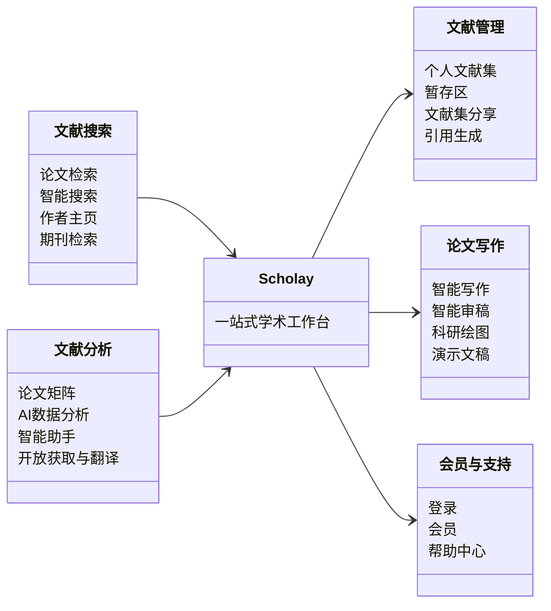

# 全站功能

## 功能地图

## 你可以前往

- [Scholay](https://www.scholay.com/wiki/scholay) — 了解定位、覆盖的研究流程，以及各功能分别从哪里进入。
- [论文检索](https://www.scholay.com/wiki/academic-search) — 用关键词和筛选发现论文；需要会话式检索时再打开智能搜索。
- [智能助手](https://www.scholay.com/wiki/claw) — 用附件、技能和工具完成分析、绘图与研究交付。
- [个人文献集](https://www.scholay.com/wiki/literature-library) — 把核对过的论文长期归档、整理和分享。
- [智能写作](https://www.scholay.com/wiki/prism) — 从 LaTeX 项目和正文工作区开始一次完整写作。
- [会员体系](https://www.scholay.com/wiki/membership) — 看 Free、Pro、Max 的额度、价格和购买入口。
